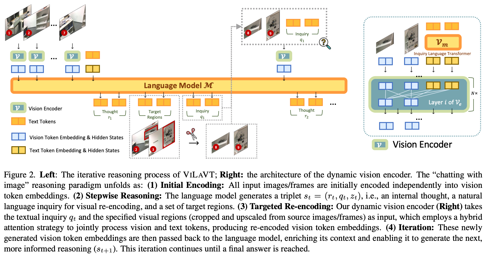

<!-- # ViLaVT: Chatting with Images for Introspective Visual Thinking -->

<div align="center">
<h1 style="font-size: 35px;">ViLaVT: Chatting with Images for Introspective Visual Thinking</h1>

  
[](https://arxiv.org/abs/2602.11073v2)
[](https://huggingface.co/datasets/AntResearchNLP/ViLaVT-Data-HF)
[](https://github.com/AntResearchNLP/ViLaVT/)
</div>

## 📋 Introduction


**ViLaVT** introduces a new chatting with images paradigm for introspective visual thinking. Instead of relying on a one-time, static visual encoding (“thinking about images”) or invoking external tools/code with limited visual prompts (“thinking with images”), ViLaVT treats visual interaction as language-guided visual feature modulation: at each step, the model outputs a natural-language inquiry and uses it to dynamically re-encode multiple visual regions jointly, preserving fine-grained details and enabling stronger cross-view geometric/spatial reasoning. 

Powered by a dedicated **dynamic vision encoder** and a **two-stage SFT → RL** training pipeline, ViLaVT delivers strong, consistent gains across diverse benchmarks—especially on multi-image and video-based spatial reasoning.

<p align="center">
  <!-- <b>ViLaVT</b><br> -->
  
</p>


## ✨ Key Features

- **Chatting with Images**: Uses expressive natural-language inquiries to drive visual feature re-encode, avoiding brittle low-level tool/code prompts while better aligning linguistic intent with visual evidence. 

- **Joint Multi-image / Multi-region Encoding for Cross-view Reasoning**: Re-architected vision encoder supports joint processing of non-contiguous regions from multiple images/frames conditioned on the inquiry, enabling relational comparison directly in feature space. 

- **Strong Empirical Performance**: Evaluated on a diverse suite of benchmarks, achieving strong and consistent improvements with particularly pronounced gains on complex multi-image and video spatial reasoning tasks. 


## 🚀 Quickstart

### 0. Setup


```bash
cd ViLaVT
bash setup.sh
conda activate vilavt
```

### 1. Data Preparation
Download the sft and reinforcement learning dataset [ViLaVT-Data-HF](https://huggingface.co/datasets/AntResearchNLP/ViLaVT-Data-HF). Put the downloaded dataset to `ViLaVT-data`.

Then unzip the data
```bash
cd ViLaVT
python ViLaVT-data/unzip.py
```


### 2. Training
#### 2.1 Supervised Fine-Tuning

The training dataset configuration is defined in `qwen_vl_finetune/qwenvl/data/__init__.py`.
For more details on the configuration format, please refer to the [QwenVL Training Framework](https://github.com/QwenLM/Qwen3-VL/tree/main/qwen-vl-finetune).

python

```python
# 1. Define a dataset entry
DATASET_NAME = {
    "annotation_path": "/path/to/annotations.json",
    "data_path": "/path/to/image/data",  # Can be empty if paths are embedded in annotations
}

# 2. Register your dataset by adding it to data_dict
data_dict = {
    "your_dataset_name": DATASET_NAME,
    # ... other datasets
}
```

In `qwen_vl_finetune/qwenvl/data/__init__.py`, replace the `annotation_path` and `data_path` fields with the actual paths under `ViLaVT/ViLaVT-data` for the following datasets:
```
sr_91k_v2, spar7m_v2, vgr_v2, thyme_2turn_v2, sr_91k_text, spar7m_text, thyme_text_v2, vica_cot, vica_text.
```

Use the following commands to set distributed training parameters and start SFT:
```bash
cd ViLaVT/ qwen_vl_finetune 
# Example: single node with 8 GPUs
export NNODES=1             # total nnodes
export NODE_RANK=0          # rank of this node (0 for single-node training)
export MASTER_ADDR=localhost  # IP or hostname of the master node
export MASTER_PORT=29500      # port on the master node
sh scripts/sft_vilavt.sh
```

#### 2.2 RL Training

Before RL training, the SFT checkpoint must be converted to be compatible with the custom class `Qwen2_5_VLForConditionalGeneration_Vilavt`, so that it can be loaded by both Transformers and vLLM.


First, configure the source and destination paths in the `__main__` block of `ViLaVT/reload_config.py`:
```python
if __name__ == "__main__":
    # TODO: replace these with your actual paths
    src = "path/to/vilavt_sft"          # original SFT checkpoint
    dst = "path/to/vilavt_sft_modified" # converted checkpoint
    convert(src, dst)
```

Then run the conversion script:
```bash
cd ViLaVT
python reload_config.py
```
The resulting checkpoint at the destination path (`dst`) should be used for all subsequent RL training stages and vLLM-based inference.


Since vLLM is used for policy rollouts, register the ViLaVT model with vLLM following the [vLLM Model Registration](https://docs.vllm.ai/en/stable/contributing/model/registration/ ) guide:

```bash
cd ViLaVT/vllm_eval/vllm_vilavt
pip install -e .  # Out-of-tree models registeration
```


We use [EasyR1](https://github.com/hiyouga/EasyR1) to train the model by reinforcement learning and put the training script in `rl/scripts`. We recommend use `ray` for multi-node training, refer to [EasyR1 in Multi-node](https://github.com/hiyouga/EasyR1?tab=readme-ov-file#how-to-run-70b-model-in-multi-node-environment). In `rl/scripts/train_grpo.sh`, set the `MODEL_PATH` and `data.train_files`.

Then, use the following script to start the RL training.
```
cd ViLaVT
## if use distributed training, start ray head node and worker node first.
bash rl/scripts/train_grpo.sh       
```


### 3. Inference & Evaluation

You can download the pretrained models:
- [ViLaVT](https://huggingface.co/AntResearchNLP/ViLaVT)
- [ViLaVT-cold-start](https://huggingface.co/AntResearchNLP/ViLaVT-cold-start)

We provide multiple evaluation pipelines

#### 3.1 Transformer-based evaluation

Update the checkpoint path in `eval/eval_vilavt.sh` to the directory where you saved the downloaded model, then run:
```bash
cd ViLaVT
sh eval/eval_vilavt.sh
```

After inference finishes, compute metrics with:
```bash
cd ViLaVT
sh eval/cal_metrics.sh
```

#### 3.2 VLMEvalKit for general benchmarks

1. Install VLMEvalKit:

```bash
cd ViLaVT/VLMEvalKit
pip install -e .          
```

2. For example, to evaluate on HRBench with 8 GPUs, simply run (under VLMEvalKit directory):
```bash
torchrun --nproc-per-node=8 run.py --data HRBench4K HRBench8K --model ViLaVT-7B --verbose
```

#### 3.3 vLLM-based evaluation


1. Register the ViLaVT model in vLLM (see [vLLM Model Registration](https://docs.vllm.ai/en/stable/contributing/model/registration/)):

```bash
cd ViLaVT/vllm_eval/vllm_vilavt
pip install -e .  # Out-of-tree models registeration
```

2. Update the checkpoint path in `vllm_eval/infer_vilavt.sh` to the directory where you saved the downloaded model, then run:
```bash
cd ViLaVT
sh vllm_eval/infer_vilavt.sh
```

After inference finishes, compute metrics with:
```bash
cd ViLaVT
sh vllm_eval/cal_metrics.sh
```


# Acknowledgment

We sincerely appreciate the valuable contributions from the open-source community. This work builds upon the following projects: 
- [Qwen2.5-VL](https://github.com/QwenLM/Qwen3-VL): The base model we utilzed.
- [verl](https://github.com/volcengine/verl) and [EasyR1](https://github.com/hiyouga/EasyR1): The reinforcement learning frameworks we use for training.


# 📖 Citation
If you find our work helpful, please cite our paper:

```bibtex
@misc{wu2026chattingimagesintrospectivevisual,
      title={Chatting with Images for Introspective Visual Thinking}, 
      author={Junfei Wu and Jian Guan and Qiang Liu and Shu Wu and Liang Wang and Wei Wu and Tieniu Tan},
      year={2026},
      eprint={2602.11073},
      archivePrefix={arXiv},
      primaryClass={cs.CV},
      url={https://arxiv.org/abs/2602.11073}, 
}
@inproceedings{wu2025reinforcing,
    title={Reinforcing Spatial Reasoning in Vision-Language Models with Interwoven Thinking and Visual Drawing},
    author={Junfei Wu and Jian Guan and Kaituo Feng and Qiang Liu and Shu Wu and Liang Wang and Wei Wu and Tieniu Tan},
    booktitle={The Thirty-ninth Annual Conference on Neural Information Processing Systems},
    year={2025},
    url={https://openreview.net/forum?id=yyWeSAsOhs}
}


@article{cheng2025vilamp,
    title={Scaling Video-Language Models to 10K Frames via Hierarchical Differential Distillation},
    author={Cheng, Chuanqi and Guan, Jian and Wu, Wei and Yan, Rui},
    journal={arXiv preprint arXiv:2504.02438},
    year={2025}
}
```